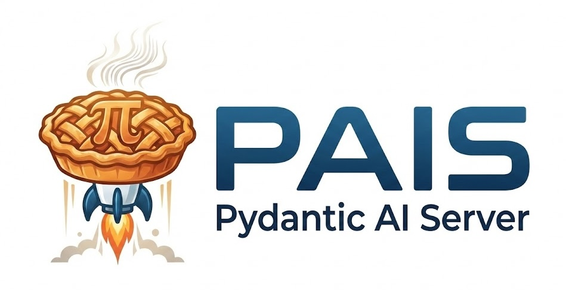

# 🥧 PAIS: Pydantic AI Server

<p align="center">
  <strong>Enterprise server wrapper for Pydantic AI agents on Kubernetes</strong>
</p>

<p align="center">
  
</p>

<p align="center">
  <a href="https://opensource.org/licenses/Apache-2.0"></a>
  <a href="https://python.org"></a>
  <a href="https://ai.pydantic.dev"></a>
</p>

---

PAIS wraps [Pydantic AI](https://ai.pydantic.dev) agents with production server capabilities: OpenAI-compatible HTTP API, distributed memory, multi-agent delegation, health probes, A2A discovery, and OpenTelemetry instrumentation.

## Features

| Feature | Description |
|---------|-------------|
| **OpenAI-Compatible API** | `/v1/chat/completions` endpoint (streaming + non-streaming) |
| **Distributed Memory** | Local, Redis, or NullMemory backends with session persistence |
| **Multi-Agent Delegation** | Sub-agent orchestration via `DelegationToolset` |
| **MCP Tool Integration** | Connect to MCP servers via Streamable HTTP |
| **A2A Discovery** | `/.well-known/agent.json` A2A-compliant card for agent-to-agent communication |
| **Health Probes** | `/health` and `/ready` endpoints for Kubernetes |
| **OpenTelemetry** | Tracing, metrics, and log correlation out of the box |
| **String Mode** | Tool calling for models without native function calling |
| **Custom Agents** | Wrap your own Pydantic AI agent with `create_agent_server()` |

## Quick Start

### Installation

```bash
pip install pai-server
```

### Minimal Agent

```python
from pais.server import create_agent_server

server = create_agent_server()
app = server.app
```

```bash
AGENT_NAME=my-agent MODEL_API_URL=http://localhost:11434 MODEL_NAME=llama3.2 \
  uvicorn pais.server:get_app --factory --host 0.0.0.0 --port 8000
```

### Custom Pydantic AI Agent

```python
from pydantic_ai import Agent
from pais.server import create_agent_server

agent = Agent(system_prompt="You are a helpful assistant.")

@agent.tool_plain
def greet(name: str) -> str:
    return f"Hello, {name}!"

server = create_agent_server(custom_agent=agent)
app = server.app
```

## Configuration

All settings are environment variables (via `pydantic-settings`):

| Variable | Required | Description |
|----------|----------|-------------|
| `AGENT_NAME` | ✅ | Agent name |
| `MODEL_API_URL` | ✅ | LLM API base URL |
| `MODEL_NAME` | ✅ | Model identifier |
| `AGENT_INSTRUCTIONS` | | System prompt |
| `AGENT_SUB_AGENTS` | | Sub-agents: `name:url,name:url` |
| `MCP_SERVERS` | | Comma-separated MCP server names |
| `MCP_SERVER_<NAME>_URL` | | URL for each MCP server |
| `MEMORY_TYPE` | | `local` (default), `redis`, or `null` |
| `MEMORY_REDIS_URL` | | Redis URL (when `MEMORY_TYPE=redis`) |
| `TOOL_CALL_MODE` | | `auto` (default), `native`, `string` |
| `OTEL_ENABLED` | | Enable OpenTelemetry |

## Architecture

```
┌─────────────────────────────────────────┐
│              AgentServer                │
│  ┌─────────┐  ┌──────────┐  ┌────────┐ │
│  │ Pydantic│  │Delegation│  │  MCP   │ │
│  │ AI Agent│  │ Toolset  │  │Servers │ │
│  └────┬────┘  └────┬─────┘  └───┬────┘ │
│       │            │             │      │
│  ┌────┴────────────┴─────────────┴────┐ │
│  │         Memory (Local/Redis)       │ │
│  └────────────────────────────────────┘ │
│                                         │
│  Routes: /v1/chat/completions           │
│          /health  /ready                │
│          /.well-known/agent.json        │
│          /memory/events  /memory/sessions│
└─────────────────────────────────────────┘
```

## Module Structure

```
pais/
├── server.py       # AgentServer, create_agent_server(), routes, logging
├── serverutils.py  # AgentDeps, AgentCard, RemoteAgent, AgentServerSettings, model resolution
├── tools.py        # DelegationToolset, string-mode handler, progress events
├── memory.py       # Memory ABC, LocalMemory, RedisMemory, NullMemory
└── telemetry.py    # OpenTelemetry setup, SERVICE_NAME, metrics
```

## Development

```bash
cd pydantic-ai-server
source .venv/bin/activate
make format          # black .
make lint            # black --check . && ty check
python -m pytest tests/ -v
```

## License

Apache 2.0 — see [LICENSE](../../LICENSE).
