# 🥧 PAIS: Pydantic AI Server

<p align="center">
  <strong>Enterprise server wrapper for Pydantic AI agents on Kubernetes</strong>
</p>

<p align="center">
  
</p>

<p align="center">
  <a href="https://opensource.org/licenses/Apache-2.0"></a>
  <a href="https://python.org"></a>
  <a href="https://ai.pydantic.dev"></a>
</p>

---

PAIS wraps [Pydantic AI](https://ai.pydantic.dev) agents with production server capabilities: OpenAI-compatible HTTP API, distributed memory, multi-agent delegation, health probes, A2A discovery, and OpenTelemetry instrumentation.

## Features

| Feature | Description |
|---------|-------------|
| **OpenAI-Compatible API** | `/v1/chat/completions` endpoint (streaming + non-streaming) |
| **Distributed Memory** | Local, Redis, or NullMemory backends with session persistence |
| **Multi-Agent Delegation** | Sub-agent orchestration via `DelegationToolset` |
| **MCP Tool Integration** | Connect to MCP servers via Streamable HTTP |
| **A2A Discovery** | `/.well-known/agent.json` A2A-compliant card for agent-to-agent communication |
| **Health Probes** | `/health` and `/ready` endpoints for Kubernetes |
| **OpenTelemetry** | Tracing, metrics, and log correlation out of the box |
| **String Mode** | Tool calling for models without native function calling |
| **Custom Agents** | Wrap your own Pydantic AI agent with `pais run` — zero KAOS imports |

## Quick Start

### Installation

```bash
pip install pydantic-ai-server         # Library only
pip install pydantic-ai-server[cli]    # With CLI
```

### SDK Usage

Create a custom agent with pure Pydantic AI — zero boilerplate:

```python
# server.py
from pydantic_ai import Agent

agent = Agent(
    model="test",
    instructions="You are a helpful assistant.",
    defer_model_check=True,
)

@agent.tool_plain
def greet(name: str) -> str:
    """Say hello to someone."""
    return f"Hello, {name}!"
```

Run it locally:

```bash
# Default: discovers Agent in server.py
AGENT_NAME=my-agent MODEL_API_URL=http://localhost:11434 MODEL_NAME=llama3.2 \
  pais run

# With flags
pais run server.py --host 127.0.0.1 --port 9000 --reload
```

The `pais run` CLI auto-discovers your `Agent` and wraps it with PAIS (health probes, A2A card, memory, OpenAI-compatible API).

For explicit ASGI app creation (e.g., custom middleware):

```python
from pais import serve
app = serve(agent)  # Returns FastAPI ASGI app
```

### Deploy and Scale to Kubernetes

Use [KAOS](https://github.com/axsaucedo/kaos) to deploy agents to any Kubernetes cluster:

```bash
# 1. Install the KAOS operator
kaos system install --wait

# 2. Deploy a Model API (LLM backend)
kaos modelapi deploy my-api --mode Hosted -m smollm2:135m --wait

# 3. Scaffold and build a custom agent
pais init my-agent && cd my-agent
pais build --name my-agent --tag v1

# 4. Deploy the agent to Kubernetes
kaos agent deploy my-agent --modelapi my-api --model smollm2:135m --expose --wait

# 5. Invoke the agent
kaos agent invoke my-agent --message "Say hello!"
```

For KIND clusters, add `--kind-load` when building:

```bash
pais build --name my-agent --tag v1 --kind-load
```

## Architecture

PAIS wraps a standard Pydantic AI `Agent` with enterprise server capabilities. The `AgentServer` is the central component — it owns the agent instance and provides HTTP routing, memory persistence, delegation, and observability.

```mermaid
graph TD
    Client([Client]) -->|POST /v1/chat/completions| Server[AgentServer]

    subgraph PAIS["🥧 PAIS"]
        Server --> Agent[Pydantic AI Agent]
        Server --> Memory[(Memory<br/>Local / Redis)]
        Agent --> Delegation[DelegationToolset]
        Agent --> MCP[MCP Toolsets]
    end

    Agent -->|LLM calls| ModelAPI[Model API]
    Delegation -->|HTTP| SubAgent([Sub-Agents])
    MCP -->|Streamable HTTP| MCPSrv([MCP Tool Servers])

    Server -->|GET /health /ready| K8s([Kubernetes])
    Server -->|GET /.well-known/agent.json| A2A([A2A Discovery])
```



**Key components:**

- **`AgentServer`** (`server.py`): Central server — owns the Pydantic AI agent, FastAPI routes, request processing, and streaming. Created via `create_agent_server()` factory.
- **`DelegationToolset`** (`tools.py`): Exposes sub-agents as `delegate_to_{name}` tools via Pydantic AI's `AbstractToolset`. Enables multi-agent orchestration without custom loop code.
- **`Memory`** (`memory.py`): ABC with `LocalMemory`, `RedisMemory`, and `NullMemory` backends. Persists conversation history across sessions — Pydantic AI has no built-in persistence.
- **`AgentCard`** (`serverutils.py`): A2A-compliant discovery card served at `/.well-known/agent.json`. Automatically discovers tools from connected MCP servers.
- **`telemetry.py`**: OpenTelemetry setup — Pydantic AI instrumentation + KAOS delegation spans, metrics, and log correlation.

## Development

```bash
cd pydantic-ai-server
source .venv/bin/activate
make format          # black .
make lint            # black --check . && ty check
python -m pytest tests/ -v
```

## Configuration Reference

All settings are environment variables:

| Variable | Required | Description |
|----------|----------|-------------|
| `AGENT_NAME` | ✅ | Agent name |
| `MODEL_API_URL` | ✅ | LLM API base URL |
| `MODEL_NAME` | ✅ | Model identifier |
| `AGENT_INSTRUCTIONS` | | System prompt |
| `AGENT_SUB_AGENTS` | | Sub-agents: `name:url,name:url` |
| `MCP_SERVERS` | | Comma-separated MCP server names |
| `MCP_SERVER_<NAME>_URL` | | URL for each MCP server |
| `MEMORY_TYPE` | | `local` (default), `redis`, or `null` |
| `MEMORY_REDIS_URL` | | Redis URL (when `MEMORY_TYPE=redis`) |
| `TOOL_CALL_MODE` | | `auto` (default), `native`, `string` |
| `OTEL_ENABLED` | | Enable OpenTelemetry |

## License

Apache 2.0 — see [LICENSE](../../LICENSE).
